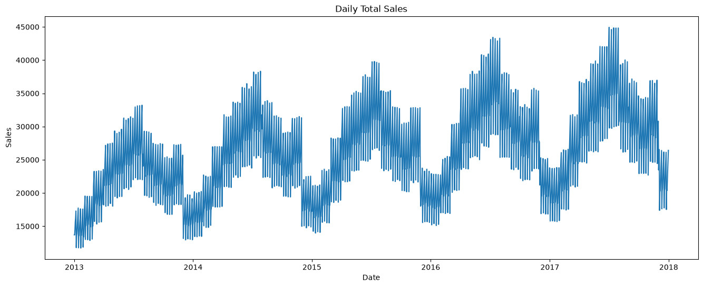
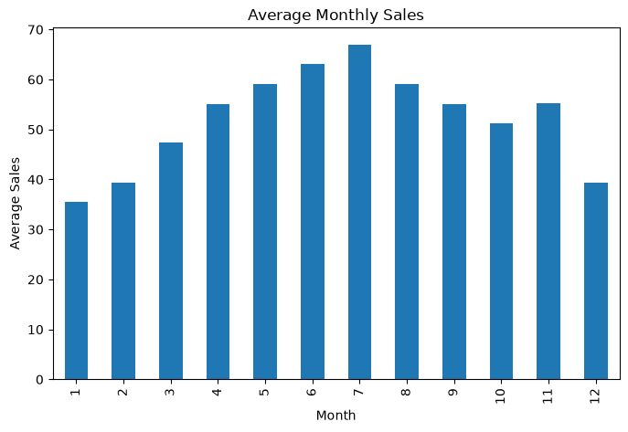
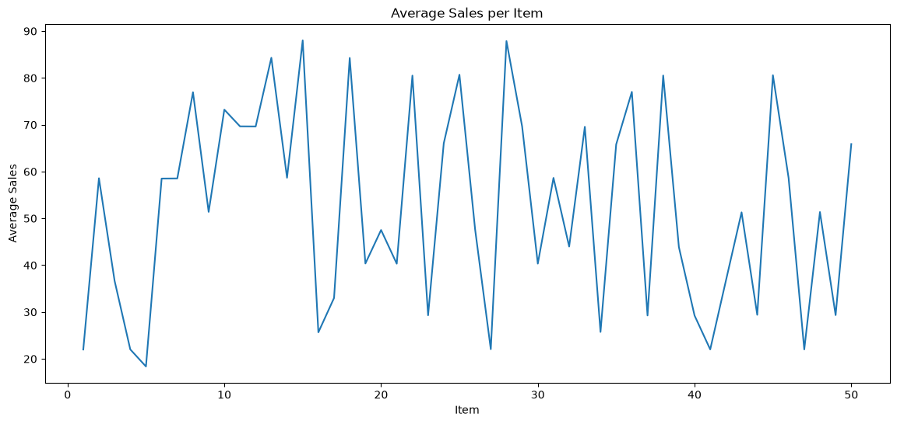
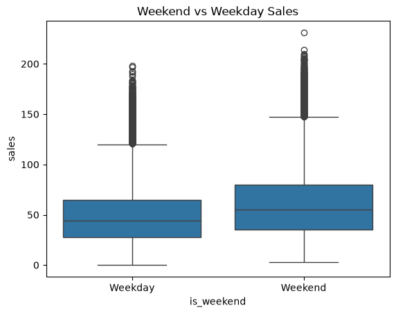
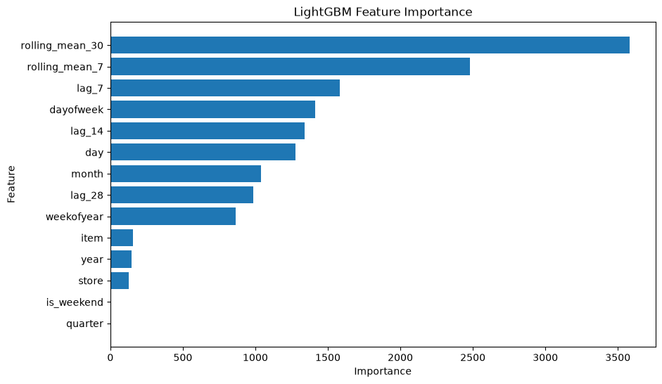
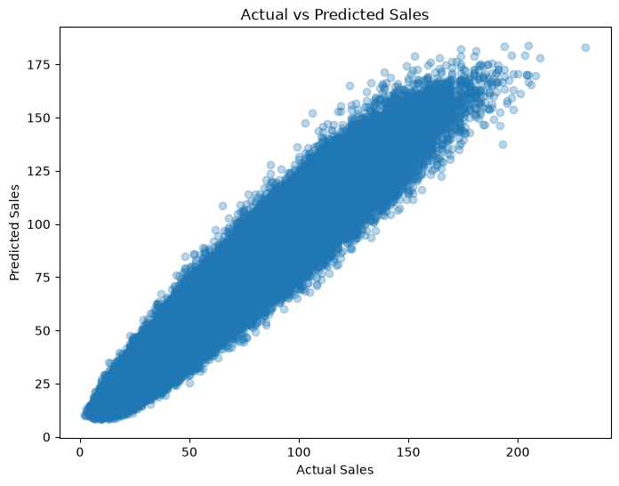

# 📈 Multi-Series Retail Demand Forecasting using LightGBM

## 📌 Project Overview

This project focuses on forecasting daily retail demand across multiple store-item combinations using historical sales data. Accurate demand forecasting helps businesses optimize inventory, reduce stock shortages, and improve supply chain efficiency.

The project uses the **Store Item Demand Forecasting Challenge** dataset from Kaggle and builds a machine learning model using **LightGBM** with time-series feature engineering techniques.

---
## 📷 Project Preview

### 📈 Daily Sales Trend


---

### 📅 Average Monthly Sales


---

### 🛒 Average Sales per Item


---

### 📦 Weekend vs Weekday Sales


---

### ⭐ LightGBM Feature Importance


---

### 🎯 Actual vs Predicted Sales


## 🎯 Objective

The primary objective is to predict future daily sales for different store-item combinations by capturing:

- Time-series trends
- Seasonality
- Weekly and monthly sales patterns
- Historical sales behavior using lag features
- Rolling average statistics

---

## 📂 Dataset

Dataset Source:
- **Kaggle:** Store Item Demand Forecasting Challenge

Files Used:

- `train.csv`
- `test.csv`
- `sample_submission.csv`

Dataset Characteristics:

- 5 years of historical sales data
- 10 Stores
- 50 Items
- Daily sales records
- 913,000 training observations

---

## 🛠️ Technologies Used

- Python
- Pandas
- NumPy
- Matplotlib
- Scikit-learn
- LightGBM
- Jupyter Notebook

---

## 📊 Exploratory Data Analysis (EDA)

The following analyses were performed:

- Daily sales trend visualization
- Monthly average sales analysis
- Average sales per item
- Weekday vs Weekend sales comparison
- Missing value analysis
- Statistical summary of the dataset

---

## ⚙️ Feature Engineering

Several time-series features were created to improve forecasting performance.

### Date Features

- Year
- Month
- Day
- Day of Week
- Week of Year
- Quarter
- Weekend Indicator

### Lag Features

- Lag 7
- Lag 14
- Lag 28

### Rolling Statistics

- 7-Day Rolling Mean
- 30-Day Rolling Mean

These features help the model capture temporal dependencies and recurring sales patterns.

---

## 🤖 Model

Model Used:

**LightGBM Regressor**

Parameters:

- n_estimators = 500
- learning_rate = 0.05
- random_state = 42

Training Period:

- 2013–2016

Validation Period:

- 2017

---

## 📈 Model Performance

| Metric | Value |
|---------|------:|
| Validation MAE | **6.10** |
| Validation SMAPE | **12.06%** |

---

## 📊 Feature Importance

The most influential features identified by the model were:

1. Rolling Mean (30 Days)
2. Rolling Mean (7 Days)
3. Lag 7
4. Day of Week
5. Lag 14
6. Day
7. Month
8. Lag 28
9. Week of Year

This indicates that historical demand and seasonal patterns are the strongest predictors of future sales.

---

## 📁 Project Structure

```
Retail-Demand-Forecasting/
│
├── data/
│   ├── train.csv
│   ├── test.csv
│   └── sample_submission.csv
│
├── Demand_Forecasting.ipynb
├── requirements.txt
├── lightgbm_sales_forecasting.pkl
├── feature_importance.csv
├── README.md
└── .gitignore
```

---

## 🚀 How to Run the Project

### Clone the Repository

```bash
git clone <repository-url>
```

### Navigate to the Project Folder

```bash
cd Retail-Demand-Forecasting
```

### Install Dependencies

```bash
pip install -r requirements.txt
```

### Launch Jupyter Notebook

```bash
jupyter notebook
```

Open:

```
Demand_Forecasting.ipynb
```

Run all cells sequentially.

---

## 📌 Key Learnings

- Time-series feature engineering
- Lag feature creation
- Rolling window statistics
- Seasonal demand analysis
- LightGBM regression for forecasting
- Model evaluation using MAE and SMAPE

---

## 🔮 Future Improvements

Potential enhancements include:

- Recursive multi-step forecasting
- Hyperparameter tuning using Optuna
- XGBoost and CatBoost model comparison
- Prophet and ARIMA benchmarking
- Deep learning approaches (LSTM/GRU)
- Ensemble forecasting methods

---

## 📚 References

- Kaggle Store Item Demand Forecasting Challenge
- LightGBM Documentation
- Scikit-learn Documentation